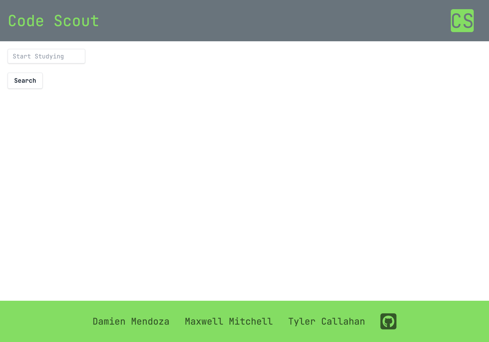

# code-scout

### Description
- Our motivation for creating this project was to give developers a uniquie search engine to make studying and reaserching easy and all in one place. while implementing Tailwindcss and Web APIs.
- We build this project to give developers embeded youtube videos and url links that correspond to the topics that are entered in the search bar.
- The problem was having to many tabs open while studying. We solved this by creating a streamline approach that renders google search result as well as a list of embeded youtube videos seamlessly all on a single page.
- We learned how to implement APIs and use Tailwindcss for our application. We also learned how to use agile development methods and git version control.
##
### Usage
- When the user opens the application they are shown a search bar that says start studying, When the user types in a topic and clicks 'serach', a list of youtube videos and url links are displayed on the page to the right of the search bar, At this point the user can click any video or url link and they will be dirrected to that specific video or website pertaining to the topic entered in the search bar. In the footer of the webpage are hyper links to each of the contributors github profiles. 

.png)

[Code-Scout](https://maxwellmitchell93.github.io/code-scout/)
#
### Credits

- [Damien Mendoza](https://github.com/DMendoza013)

- [Tyler Callahan](https://github.com/Lysantheum)

- [Maxwell Mitchell](https://github.com/maxwellmitchell93)